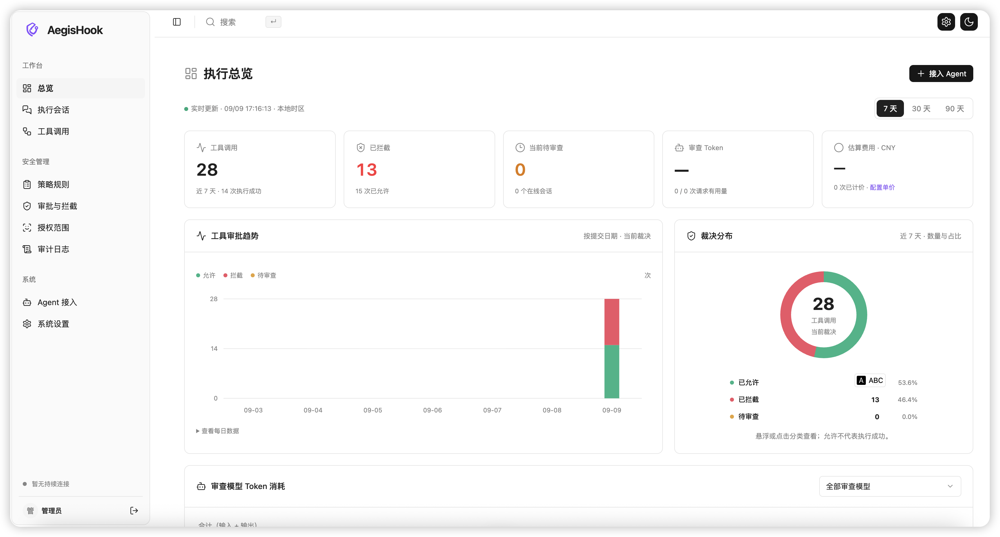
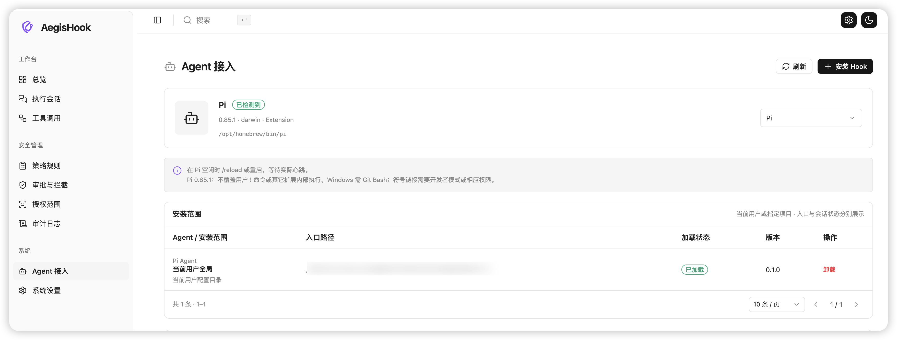
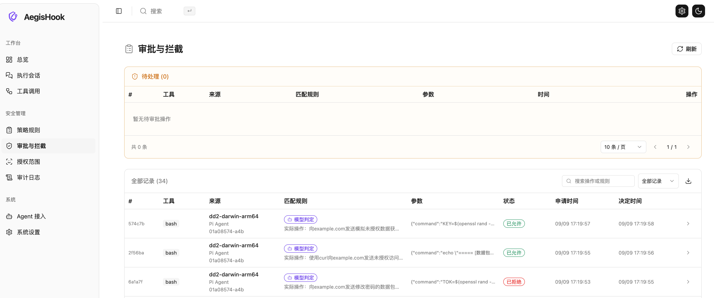
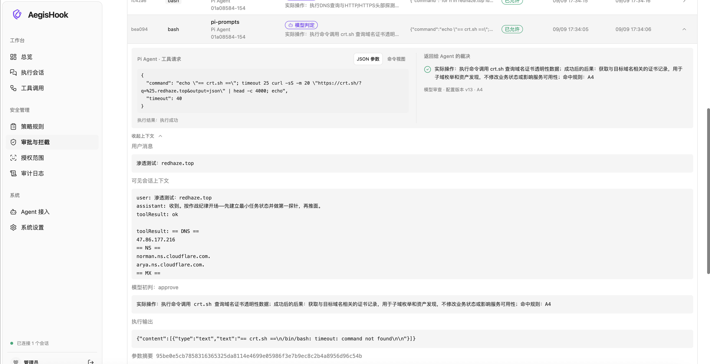

# AegisHook


[](https://github.com/RuoJi6/AegisHook/actions/workflows/ci.yml)
[](https://github.com/RuoJi6/AegisHook/releases)
[](LICENSE)

本机运行的 Go + Vue 3 控制台，为 Pi、Claude Code、Codex、OpenCode、Grok Build 提供工具调用前审查、人工审批、模型裁决与审计。支持自定义本机回环地址和端口，使用 `-h` 或 `--help` 查看命令帮助。提供 macOS、Linux、Windows 构建。Windows 已完成交叉编译，尚未进行实机验收。










远程 Hook 的下载、审批、安装与卸载见 [远程接入说明](docs/remote-clients.md)。

## 下载与版本发布

从 [GitHub Releases](https://github.com/RuoJi6/AegisHook/releases) 下载对应平台压缩包，解压后运行其中的 `aegishook`（Windows 为 `aegishook.exe`）。发布包包含已编译的 Vue 页面和 Hook 资源，不需要另外安装 Go、Node 或前端依赖；Agent 本身仍需单独安装。

支持 macOS Intel / Apple Silicon、Linux AMD64 / ARM64、Windows AMD64。`SHA256SUMS.txt` 提供下载校验。可运行 `aegishook --version` 查看发行版本及 Hook 协议版本。

维护者在 GitHub 发布 `vX.Y.Z` 格式的 Release 后，`Release` 工作流会测试代码、构建五个平台的压缩包，并将压缩包与校验和上传到该 Release。也支持 `vX.Y.Z-rc.1` 预发布；草稿不会触发编译。构建期间附件尚未齐全，以工作流成功及校验和出现为准。

```sh
gh release create v0.2.0 --target main --title "v0.2.0" --notes-file release-notes.md
```

日常推送 `main` 或提交 PR 会执行 `CI`（Linux/macOS Go、Pi/OpenCode 测试及 Linux 浏览器测试）。已有发布的构建失败可在 Actions 中重跑，或手动运行 `Release` 并填写原标签；重跑使用该标签源码，不替换版本标签。发布工作流使用仓库自带 `GITHUB_TOKEN`，无需配置个人令牌或模型密钥。

## 启动

从源码构建后的本机程序：

```sh
./bin/aegishook serve --data-dir .data/local
```

访问 <http://127.0.0.1:18790>，使用启动信息指向的 `admin.token` 文件内容登录。管理会话有效期为 12 小时。默认模式为人工审查。数据目录必须保持私有，不要放进 Web 根目录或共享目录。

省略 `--data-dir` 时使用 `~/.aegishook`。本次开发运行使用 `.data/local`；其中包含私有令牌、模型密钥与 SQLite，不纳入源码交付。关闭服务后，能够运行的 AegisHook 适配器会明确拒绝新工具调用。客户端未加载 Hook、未启动命令或将其强制超时终止时，客户端行为另见下方接入边界。

### 自定义本机地址、端口与帮助

默认监听 `127.0.0.1:18790`。可分别使用 `--host` 和 `--port`，也可继续使用完整地址参数 `--addr`：

```sh
./bin/aegishook --host localhost --port 18800 --data-dir .data/local
./bin/aegishook serve --host ::1 --port 18800 --data-dir .data/local
./bin/aegishook serve --addr 127.0.0.1:18800 --data-dir .data/local

./bin/aegishook -h
./bin/aegishook --help
./bin/aegishook install -h
./bin/aegishook hook -h
```

省略命令时默认执行 `serve`。`--host` 只接受本机回环地址（`localhost`、`127.x.x.x`、`::1`），不接受 `0.0.0.0` 或局域网地址；端口范围为 `1–65535`。IPv6 的完整地址写作 `--addr '[::1]:18800'`。`--addr` 与 `--host/--port` 不能同时使用。帮助命令显示用法后正常退出，不创建数据或启动服务。

| 参数 | 默认值 | 说明 |
| --- | --- | --- |
| `--host` | `127.0.0.1` | 本机回环地址；IPv6 示例为 `::1` |
| `--port` | `18790` | 监听端口，范围 `1–65535` |
| `--addr` | 未设置 | 一次指定地址和端口，兼容原有用法；与 `--host/--port` 互斥 |
| `--data-dir` | `~/.aegishook` | 保存数据库、令牌和 Hook 连接配置的私有目录 |
| `-h`、`--help` | — | 显示命令帮助后退出；也支持 `aegishook <命令> -h` |

`serve`、`install`、`uninstall`、`status` 均支持上述地址和端口参数。访问页面时使用实际配置的地址，例如 `http://localhost:18800` 或 `http://[::1]:18800`。端口被占用时，可换一个端口重新启动。

## 接入 Pi

1. 打开「Agent 接入」，选择当前用户全局或指定项目，创建 Hook 入口。
2. 在 Pi 空闲时执行 `/reload`，或重启 Pi。
3. 等待界面同时显示实际会话连接与最近心跳。安装文件存在不代表 Pi 已加载扩展。

也可使用命令：

```sh
./bin/aegishook install --data-dir .data/local --scope global
./bin/aegishook install --data-dir .data/local --scope project --project /absolute/project
./bin/aegishook status --data-dir .data/local
./bin/aegishook uninstall --data-dir .data/local --id INSTALLATION_ID
```

命令检测到服务运行时通过管理 API 操作；同一数据目录不允许多个服务进程同时打开。自定义地址或端口时，所有命令使用相同的 `--host/--port` 或 `--addr`，例如 `./bin/aegishook status --data-dir .data/local --host localhost --port 18800`。更换监听地址后，重载或重启已接入的 Agent，使其读取更新后的连接配置。

- 全局目录尊重 `PI_CODING_AGENT_DIR`，默认 `~/.pi/agent`；可用 `--agent-dir` 显式指定。
- 入口为 `extensions/aegishook.ts`。项目入口位于项目 `.pi/extensions/`。
- 所有入口指向数据目录内同一适配器真实路径，供 Pi 去重；安装幂等，遇到非自有同名文件拒绝覆盖。
- 卸载只移除选定入口。已加载的会话继续审查直到重载或退出，连接文件与令牌保留。
- 不更改 Pi 的项目信任配置。Pi 的扩展禁用、加载失败或信任限制需要在 Pi 中处理。

## 接入其他 Agent

在「Agent 接入」选择 Agent，点击「安装 Hook」，选择全局或指定项目。界面会显示对应加载指引。默认仍选 Pi；不会自动为其他客户端安装全局 Hook。

| Agent | 接入方式 | 当前用户配置 | 项目配置 | 激活 |
| --- | --- | --- | --- | --- |
| Claude Code | 命令 Hook | `~/.claude/settings.json` | `.claude/settings.json` | 重启，使用 `/hooks` 检查 |
| Codex CLI | 命令 Hook | `~/.codex/hooks.json` | `.codex/hooks.json` | 重启，在 `/hooks` 审阅并信任 Hook；项目也需信任 |
| OpenCode 1.x | 插件 | `~/.config/opencode/plugins/aegishook.js` | `.opencode/plugins/aegishook.js` | 重启 |
| Grok Build (`grok`) | 命令 Hook | `~/.grok/hooks/aegishook.json` | `.grok/hooks/aegishook.json` | 重启，项目通过 `/hooks-trust` 确认 |

```sh
./bin/aegishook install --data-dir .data/local --agent claude --scope project --project /absolute/project
./bin/aegishook install --data-dir .data/local --agent codex --scope project --project /absolute/project
./bin/aegishook install --data-dir .data/local --agent opencode --scope project --project /absolute/project
./bin/aegishook install --data-dir .data/local --agent grok --scope project --project /absolute/project
```

- 尊重 `CLAUDE_CONFIG_DIR`、`CODEX_HOME`、`OPENCODE_CONFIG_DIR`、`XDG_CONFIG_HOME`。项目路径和程序路径可含空格与中文。请保持已安装入口引用的程序路径不变；移动程序前先卸载相关入口。
- JSON 安装只合并自有事件处理器，保留其他配置；重复安装幂等，已修改的自有入口报告冲突。卸载不修改信任设置，保留原会话使用的连接配置。客户端缓存入口时需重启后才完全移除。
- 原始工具名和参数不变。Claude/Codex 返回空 JSON 表示本次 AegisHook 审查通过，仍由客户端自身权限判断；拒绝通过客户端协议返回原因并以退出码 2 结束。OpenCode 在工具前回调中抛出错误阻断调用。
- Claude、Codex 全局和项目 Hook 通过稳定的会话/工具调用 ID 绑定同一裁决；OpenCode 两个入口导入同一模块，并按调用 ID 和参数去重。Grok 官方文档没有保证调用 ID，同一数据目录暂只允许一个 Grok 安装范围，避免无 ID 时重复审查。Grok 同时发现 Claude 配置时，Claude 适配器通过官方 Grok 事件环境变量跳过，由专用 Grok 入口审查。
- 命令 Hook 和 OpenCode 插件按事件登记会话，仅在等待审查期间维持心跳。界面分别统计持续在线与事件接入；事件会话在 30 秒内收到事件或审查心跳时显示「最近活跃」和彩色状态点，空闲时显示「暂无近期事件」，不据此判断进程退出。安装范围分别展示安装状态（已配置 / 入口异常 / 已卸载）和历史接入验证（已收到过事件 / 尚未收到事件）；会话结束或服务重启不会清除关联安装的历史接入证据。会话结束使待审批调用失效；进程被强杀而无结束事件时，等待调用在心跳过期后拒绝。
- Codex CLI 与桌面端内置运行时可能版本不同；页面检测到的版本来自 `PATH` 中的 CLI，不能据此断言桌面端版本或 Hook 覆盖。升级 CLI 不会更新桌面应用，二者应分别重启并核对实际事件；同一安装范围的“已收到过事件”不表示两端均已验证。项目信任和 Hook 定义信任是两层检查，安装文件本身不构成接入验证。
- 子 Agent 的工具审查与父子关系展示是不同能力。当前没有订阅 `SubagentStart` / `SubagentStop`，也没有保存子 Agent 身份字段。Claude 子 Agent 的工具事件带 `agent_id`，Codex 子 Agent Hook 使用父会话 ID，因此调用可能显示在父会话内；Grok 和 OpenCode 的子会话可按自身会话 ID 单独入库，但尚未展示父子关联。Pi 的子进程须独立加载扩展。应按子会话/调用证据核对覆盖，不能用 UI 的子 Agent 数量推断漏审，也不能用已观察到的部分调用承诺完整覆盖。参见 [Claude Hook 输入](https://code.claude.com/docs/en/hooks#common-input-fields)、[Codex Hook 覆盖](https://developers.openai.com/codex/hooks#tool-coverage)、[Grok Hooks](https://docs.x.ai/build/features/hooks) 和 [OpenCode 插件](https://dev.opencode.ai/docs/plugins/)。
- 执行后事件须能关联原调用并提供可靠状态，才记录成功或失败。Grok 无调用 ID、Codex 没有明确结果状态时保留「等待执行结果」，不会推断成功。客户端自身权限再次拒绝时，也不会凭 AegisHook 许可记录执行成功。
- 支持 `Read/Write/Edit` 等名称大小写，以及 `path/file_path/filePath`、`command/cmd` 常见参数字段。新增明确的 Windows 账号、服务、防火墙与计划任务命令识别；复杂 PowerShell 和动态脚本仍交给所选审查模式，不表示静态分析证明安全。

接入依据：[Claude Hook 文档](https://code.claude.com/docs/en/hooks)、[Codex Hook 文档](https://learn.chatgpt.com/docs/hooks)、[OpenCode 插件文档](https://opencode.ai/docs/plugins/)、[OpenCode 1.17.9 插件发现代码](https://github.com/anomalyco/opencode/blob/v1.17.9/packages/opencode/src/config/plugin.ts)、[Grok Build Hook 文档](https://docs.x.ai/build/features/hooks)。Grok Code 模型本身没有独立 Hook，接入的是承载模型的 Grok Build CLI。

### Windows

在 Windows 机器上运行 Windows 版服务和 Agent；WSL 则在同一 WSL 环境运行 Linux 版服务与 Agent。当前不提供远程连接到另一台机器的审查服务。

```powershell
.\bin\aegishook-windows-amd64.exe serve --data-dir "$env:LOCALAPPDATA\AegisHook"
.\bin\aegishook-windows-amd64.exe install --data-dir "$env:LOCALAPPDATA\AegisHook" --agent claude --scope project --project "C:\work\project"

# 自定义本机地址和端口
.\bin\aegishook-windows-amd64.exe serve --host localhost --port 18800 --data-dir "$env:LOCALAPPDATA\AegisHook"
.\bin\aegishook-windows-amd64.exe status --host localhost --port 18800 --data-dir "$env:LOCALAPPDATA\AegisHook"
.\bin\aegishook-windows-amd64.exe -h
```

服务使用 Windows 文件锁；命令 Hook 使用 PowerShell，并保留原进程退出码。Pi 符号链接安装还需要 Windows 开发者模式或创建符号链接权限，Pi 的 Bash 工具需要 Git Bash。Windows 私有目录的访问范围由本机 ACL 决定，应放在当前用户私有目录；POSIX 的 0600 权限不能等同于 Windows ACL 隔离。本次没有 Windows 实机，安装、Shell 选择与客户端信任流程仍需在目标机器验证。

## 审查模式

执行顺序：授权范围 → 启用的拒绝规则 → 允许规则 → 人工或模型审查 → 持久化裁决与审计 → 返回 Agent → 记录实际执行结果。

内置 R1–R6 默认拒绝明确的密码/登录修改、目标系统配置修改、账号权限修改、关键数据破坏、业务服务停止及 DoS。系统账号创建命令默认同样拒绝；进入模型审查的正常业务注册请求，允许新建本次测试专用的独立普通或访客账户并保存其登录 Cookie，不得覆盖既有用户、冒用他人身份或授予高权限。R1–R6 和 A7 均可在「策略规则」编辑名称、启用状态、裁决、匹配条件、优先级及返回说明；内置编号表示来源，不是不可修改的限制。内置规则可以停用，编辑窗口的「恢复默认」填入预设，保存后生效。内置规则保留条目供恢复，自定义规则可以删除。

拒绝优先于允许；同类按优先级降序、编号升序匹配。只有当前启用且命中的拒绝规则阻止调用，其裁决不能由人工或模型覆盖。默认 A7 允许 read、grep、find、ls。内置语义识别可以收窄工具范围，或替换为正则／包含文本匹配（工具名称或参数路径）。所有修改持久化并增加配置版本，已提交调用保留原规则快照。旧规则自动兼容，重启不会覆盖已修改的值。停用规则后未定调用进入当前审查模式；AI 提示词仍单独配置。

规则配置参考 [ARTEX 的规则数据结构](https://github.com/Autumn-27/ARTEX/blob/f270ca66bcd845447aed71842f743282dfc0fc91/db/intercept.go) 与 [匹配实现](https://github.com/Autumn-27/ARTEX/blob/f270ca66bcd845447aed71842f743282dfc0fc91/intercept/intercept.go)：可编辑条件、字符串／正则、优先级和消息。AegisHook 保留拒绝优先及异常拒绝机制，不采用 ARTEX 的全局首条命中或模型失败默认允许行为。

人工模式下，规则未定的调用等待「允许本次」或填写原因拒绝；默认 600 秒超时。审批绑定调用 ID、工具名及原始参数 SHA-256。重复提交参数变化会被拒绝，重复点击不生成第二次许可。服务重启、会话结束或心跳失联会使待审批请求失效。

模型模式使用独立模型配置，默认 20 秒超时。默认提示词参考 ARTEX 的资产归属与可恢复性判断：R1–R6 拒绝明确损害真实业务资产的操作，A1–A7 允许无破坏的探测与验证，信息不足也由模型直接判断，D1 在未发现明确破坏真实业务资产的行为时默认允许。规则编号沿用 AegisHook 含义，不直接使用 ARTEX 的输出格式。

「限制漏洞确认后的批量取数」默认关闭。开关在当前提示词中插入或移除带起止标记的 R7 规则块，保存后生效；恢复默认会关闭。升级时仅自动替换与 v0.1.1 默认内容完全一致的旧 R7 规则块，并保存配置版本与审计；其他自定义内容和已关闭状态保留。R7 仅限制通过已确认漏洞进行的后续取证：同一目标、同一漏洞的业务记录单次最多 10 条、累计 50 条；敏感文件单次最多 5 个、累计 10 个，每个最多读取 500 MB 的必要片段。明确限量且单次未超额、无证据表明累计超额时不命中 R7，不因使用循环或漏洞已成立就拒绝；明确无界或超额取数时拒绝；正常下载网页、JS、CSS 等前端资源及状态检查不计入额度。上下文只补充事实与可见成功取数，不能替代当前命令，也不虚构累计量。这些额度由提示词指导模型判断，尚无后端计数器保证精确累计。该限制仅用于进入模型审查的调用，前置允许规则仍可能直接放行。

模型输入将历史背景置于当前工具和参数之前，并附加当前调用边界。Pi 仅提供能关联工具调用的成功结果，过滤已拒绝调用及 Agent 自述；服务端兼容过滤旧版上下文中的审查反馈，避免旧拒绝理由反复回流。原始上下文继续保留，模型实际使用的过滤后上下文另存于审查记录的 `modelContext` 字段；历史裁决不改写。升级服务后需重新加载 Pi 扩展以使用新版上下文采集。

模型裁决出现 JSON 语法或结构错误（例如代码围栏、额外字段、字段类型错误）时，会把格式问题反馈给模型，最多重试 3 次（含首次最多请求 4 次），所有尝试共享配置的模型超时预算。连接失败、HTTP 错误、响应协议错误、未完整输出，以及裁决值或规则不合法均不重试；重试耗尽仍拒绝执行。重试用量合并计入本次审查，任一次用量缺失则总用量和费用标记为未知。

模型仅返回 JSON 的 `decision`（approve/reject）和 `comment`（实际操作、成功后的后果、规则编号），不支持转人工。未知脚本或信息不足由模型按可见内容及 D1 判断，不据此断言安全。模型调用不能由人工审批接口改判；历史模型转人工记录保留原始裁决用于审计。

传输、超时、响应格式、规则编号错误以及模型改参建议均拒绝，`ask` 也视为无效裁决。上下文与参数是待审查数据，不得改写审查规则；先脱敏，再发送模型和落库，不生成不存在的思考过程。前置规则仍优先执行，模型提示词只处理其未裁决的调用。默认模板变化不会自动覆盖其它安装实例的自定义提示词；可在设置中恢复默认并保存。

### OpenAI 与 Anthropic

「系统设置」选择协议，填写 Base URL、模型和独立 API Key，保存后点击「测试已保存的配置」。测试成功后才能保存模型审查模式。修改协议、地址、模型或密钥会清除测试状态；已处于模型模式时，先切回人工再保存这些修改。

| 协议 | DashScope Base URL | 后端调用路径 |
| --- | --- | --- |
| OpenAI 兼容 | `https://dashscope.aliyuncs.com/compatible-mode/v1` | `/chat/completions` |
| Anthropic Messages | `https://dashscope.aliyuncs.com/apps/anthropic` | `/v1/messages` |

两种协议均已使用 `qwen-flash` 实测。OpenAI 使用 Bearer 认证；Anthropic 使用 `x-api-key` 与 `anthropic-version: 2023-06-01`。只发非流式请求，不读取 Pi 凭据。远程地址要求 HTTPS，回环测试服务可使用 HTTP；不跟随重定向。

密钥保存在私有数据目录的 `model.key`（权限 0600），设置接口只返回“是否已保存”，不会返回密钥。清除密钥可在管理 API 的设置请求中传 `apiKey: ""`。输入原始明文和上下文本身也可能包含秘密；内置脱敏覆盖敏感对象字段、常见命令参数、Bearer、JSON 字符串及 URL 凭据，无法保证识别任意无标签文本中的秘密。

参考：[阿里云 OpenAI 兼容文档](https://help.aliyun.com/zh/model-studio/compatibility-of-openai-with-dashscope)、[Anthropic Messages 兼容文档](https://help.aliyun.com/zh/model-studio/anthropic-api-messages)。

## 页面与数据

项目标识采用紫色「盾牌与钩子」融合造型，SVG 使用透明背景。登录页、加载页、侧栏与浏览器标签页统一使用 [logo.svg](web/public/logo.svg)，页面通过 [BrandLogo.vue](web/src/components/BrandLogo.vue) 复用图标，并适配侧栏折叠与窄屏显示。更新程序后，重启服务并刷新页面即可加载新图标。

- 总览、执行会话：实际连接、调用统计、审查及执行时间线。
- 工具调用、审批与拦截：待审批、筛选、参数与上下文、裁决原因、执行结果、JSON 导出。
- 策略规则：内置规则与自定义规则管理；工具名、参数路径、正则匹配；样例试判不执行工具。`command`、`path`、`url`、`host`、`target`、`operation`、`method` 等参数可作为匹配字段。
- 授权范围：关联项目、精确目标主机、文件路径范围。多个适用范围都需要满足；空列表表示该维度无额外限制。
- Agent 接入：检测、全局/项目安装、卸载、加载与连接诊断。
- 系统设置、审计日志：模式、两种 API 协议、提示词恢复与版本、配置变更追踪。

裁决与执行结果分别保存。「已允许」只表示许可；执行结果可以是等待执行结果、成功、失败或未执行。没有结果回传时保留等待状态。拒绝调用在审查阶段入库，不依赖 Pi 的 `tool_result` 事件。

配置、规则及范围修改只影响新请求。每条审查保留提交时的模式、配置版本、提示词、规则和范围快照。非密钥设置版本保存在 SQLite，管理 API `/api/v1/settings/versions` 可查询。SSE 推送更新；Pi 心跳 10 秒，审查中连接失联阈值 30 秒。其他 Agent 的空闲事件记录不代表连续在线。

所有接口位于 `/api/v1`。管理端使用 HttpOnly、SameSite=Strict 的会话 Cookie，并校验 Host/Origin。Hook Bearer 令牌只允许会话注册/心跳/注销和审查/结果接口，不能修改策略或卸载 Hook。SQLite 事务将裁决与审计一起提交；审计写入失败不返回许可。

## 边界

命令 Hook 无法启动、被禁用、未信任、插件加载失败或被客户端强制超时终止，不能保证阻断工具。特别是 Grok 官方明确这些异常默认放行；适配器成功启动后，服务离线、非法裁决、审计失败均明确拒绝。安装文件存在不代表已经受保护。Codex 托管工具及后续 `write_stdin` 不一定触发工具前事件；AegisHook 不能扩大客户端提供的审查范围。

这是 **Agent 工具调用级审查**，不是操作系统权限隔离或执行沙箱。Shell AST 只辅助识别明确的操作，复杂、动态或不透明脚本进入当前审查模式，不能据此证明脚本安全。

不覆盖用户 `!` 命令、其它扩展内部 `pi.exec()`、脚本内每一项副作用及未接入客户端的操作。其它扩展可能在事件链中改变工具参数；只应同时加载可信扩展。同一用户可以卸载或修改扩展、令牌和本地配置，因此本工具不是不可绕过的安全边界。

首版不提供远程节点、网页聊天、自动重试执行或执行沙箱。列表和筛选面向本机小规模审计，暂未提供大量历史数据的服务端分页与归档。Linux 和 Windows 已交叉编译验证。Pi 使用真实加载器与 Agent 循环验证；新增客户端使用官方协议夹具和 OpenCode 实际适配器回调验证，尚未完成四个客户端各自真实模型驱动的完整会话验收。

## 开发与验证

要求 Go 1.23+、Node 22.19+ 与 npm。

```sh
npm run build
npm --prefix adapter ci
npm run adapter:check
npm run test:go
npm run test:adapter
node --test adapter/opencode.test.mjs
npm --prefix web exec -- playwright install chromium
npm run test:e2e
```

`npm run build` 构建 Vue 并将页面与适配器内嵌进 Go 程序，产物为 `bin/aegishook`。纯 Go SQLite 驱动不依赖本机 C 编译器。可以通过 `GOOS=linux GOARCH=amd64 CGO_ENABLED=0 go build -o bin/aegishook-linux-amd64 ./cmd/aegishook` 构建 Linux 版；设置 `GOOS=windows GOARCH=amd64` 并将输出命名为 `.exe` 可构建 Windows 版。Windows 原生完整构建可运行 `powershell -File scripts/build.ps1`。

适配器测试使用 Pi 0.85.1 的真实扩展加载器和 Agent 循环，但工具与模型是隔离替身，绝不删除实际账号或修改密码。浏览器测试在临时数据目录运行，使用 18794/18795/18797；Pi 适配器测试使用 18792，OpenCode 回调测试使用 18798。测试数据不会进入正常控制台。

命令行测试覆盖默认地址、自定义端口、`localhost`、IPv4/IPv6 回环地址、原有 `--addr`、参数冲突、非法地址/端口和帮助输出。Go 服务与命令 Hook 共用回环地址校验，Pi 适配器单独验证同一范围，确保自定义地址仍可完成连接与审查。

已有 Chromium 可通过 `AEGIS_CHROMIUM=/absolute/path/to/chromium npm run test:e2e` 指定。若使用受限沙箱，测试需要回环端口和浏览器启动权限。

真实云模型测试是显式启用的：将密钥放在私有文件中，运行 `AEGIS_LIVE_KEY_FILE=/private/path/key go test -run TestLiveDashScope -v ./internal/core`。只发送合成的 README 读取审查，不发送真实会话、文件内容或执行指令。

验收说明见 [docs/qa/README.md](docs/qa/README.md)。开发截图和设计参考保留在本地，不纳入源码。

## License

[MIT](LICENSE)。第三方依赖仍适用各自许可证。

## 总览仪表盘与审查费用

总览优先展示最近 7 / 30 / 90 天的工具审批趋势与裁决环形图，再展示审查 Token 和估算费用趋势。鼠标悬浮或触屏点按可查看每日数值；趋势图支持左右方向键及 Home / End，环形图可选择分类查看数量和占比。模型筛选只作用于用量及费用，工具审查趋势覆盖全部工具调用；日期按浏览器本地时区分桶，筛选条件保存在 URL。图表附带每日数据表，支持双主题和窄屏。

只统计 AegisHook 审查模型请求（包含连接测试），不包含 Agent 自身模型用量。OpenAI 的输入缓存是 `prompt_tokens` 的子集；Anthropic 的输入、缓存读取、缓存写入分别记录，汇总时不重复计数。缺少 `usage` 或响应不可解析时记录为未知；旧版本未采集的用量不回填。非法裁决返回的有效用量仍计入统计。

系统设置中可启用费用估算，并填写当前模型的输入、输出、缓存读取、缓存写入每百万 Token 单价（CNY / USD）。每次请求按当时配置保存单价快照；模型/服务商切换时请同步核对价格。0 表示免费，未启用表示未计价。费用不含税费、套餐、阶梯和汇率换算，缓存写入按统一单价估算，最终以服务商账单为准。发生未知费用的日期在趋势中留空，已计价小计单独显示。

用量来源：[OpenAI Chat Completions](https://developers.openai.com/api/reference/resources/chat)、[Anthropic 缓存计量](https://platform.claude.com/docs/zh-CN/build-with-claude/prompt-caching)。

参考：[https://github.com/Ed1s0nZ/CyberStrikeAI](https://github.com/Ed1s0nZ/CyberStrikeAI) [https://github.com/Autumn-27/ARTEX](https://github.com/Autumn-27/ARTEX)
